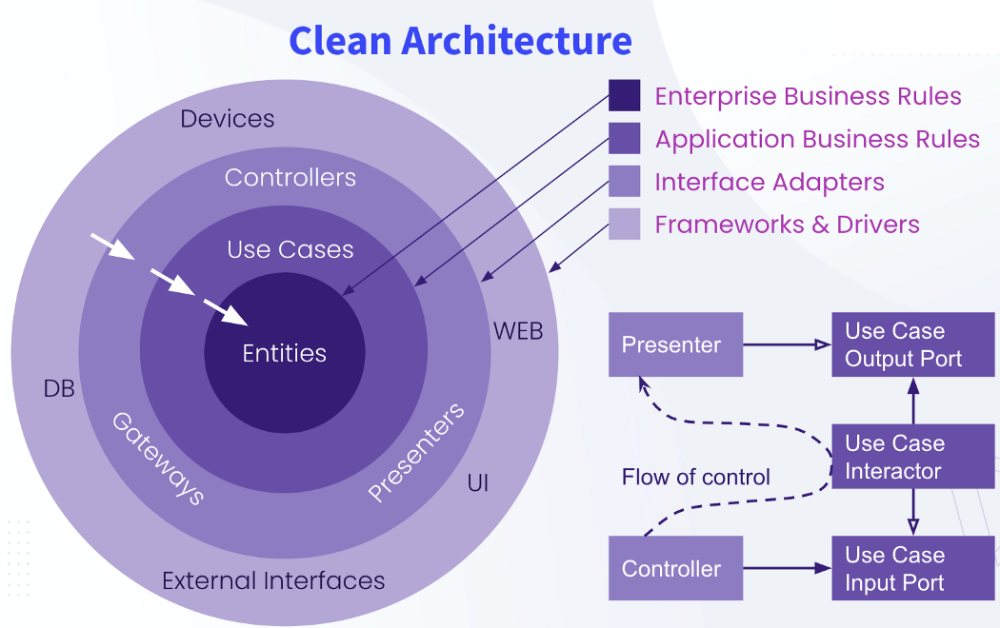

#  FIAP Tech Challenge | Delivery

### Fase 02 - Tech Challenge | Pós-graduação em Arquitetura de Software

----

## Seção 01 - INFORMAÇÕES DO GRUPO E INTEGRANTES

| MATRÍCULA  | NOME                                              | E-MAIL                                                        |  GRUPO  |
|:-----------|:--------------------------------------------------|:--------------------------------------------------------------|:-------:|
| RM354688   | Nicholas Mateus Barreto Veloso de Azevedo Dantas  | [Enviar E-mail](mailto:nicholas.mateus@gmail.com)             |   15    |
| RM354692   | Paulo Ricardo Gonçalves dos Santos                | [Enviar E-mail](mailto:pricardo.ti@gmail.com)                 |   15    |
| RM356150   | Tarcisio Dantas de Andrade                        | [Enviar E-mail](mailto:tarcisiodantas_deandrade@hotmail.com)  |   15    |

## Seção 02 - Arquitetura do Sistema e Infraestrutura

#### Arquitetura da Aplicação - Clean Architecture:

Na abordagem utilizada para a arquitetura do sistema, foi adotada a _Clean Architecture_ (**Arqutetura Limpa**). 

Essa arquitetura fornece 6 grandes beneficios, sendo eles:

1. **Modularidade:** A Clean Architecture promove um código modular, facilitando a manutenção e a escalabilidade do sistema.
2. **Independência de Frameworks:** Permite que os desenvolvedores mudem frameworks ou bancos de dados com mínima alteração no código, aumentando a flexibilidade.
3. **Testabilidade:** A separação de responsabilidades facilita a criação de testes automatizados, permitindo que diferentes partes do sistema sejam testadas de forma isolada.
4. **Manutenção Simplificada:** Com a estrutura bem definida, fica mais fácil identificar e corrigir bugs ou implementar novas funcionalidades.
5. **Clareza e Compreensão:** Uma boa organização do código torna mais fácil entender e navegar pela base de código, especialmente para novos desenvolvedores.
6. **Princípio da inversão de dependência:** Inversão de Dependência é a estratégia de depender de interfaces ou funções e classes abstratas em vez de funções e classes concretas. O que da maior flexibilidade e baixo acomplamento entre todas as camadas.

### Quais cenários ou situações devemos usar ?

Construir aplicações **complexas** ou de **longa duração** onde a **manutenção, a testabilidade e a escalabilidade são cruciais**. _Clean Architecture_ é adequado para projetos onde o modelo de domínio é fundamental para a funcionalidade da aplicação e precisa ser bem definido e encapsulado. 

**Projetos que Precisam de Integração com Múltiplos Sistemas:** Facilita a integração e as mudanças necessárias à medida que novos componentes são adicionados ao ecossistema do software.
**Ambientes Ágeis:** Pode ser benéfica em ambientes onde são frequentes as mudanças nos requisitos, permitindo que a estrutura ajude a adaptar o código de maneira eficiente.


---



_Diagrama Clean Architecture (Robert C. Martin)._

---


_Fluxo de execução das camadas da aplicação._

#### Arquitetura Infraestrutura - Kubernetes

O Kubernetes é um sistema de orquestração de contêineres de código aberto, desenvolvido pelo Google, que automatiza a implantação, o dimensionamento e a gestão de aplicações em contêineres. 

*Usabilidade:*
- *Automação:* Gerencia automaticamente a distribuição e a execução dos contêineres em clusters de máquinas.
- *Escalabilidade:* Permite escalar aplicações para cima ou para baixo conforme a demanda.
- *Alta Disponibilidade:* Garante que a aplicação esteja disponível e funcionando mesmo se houver falhas em alguns contêineres ou nós.
- *Desdobramento e Atualizações:* Facilita a implementação de novas versões de aplicações e rollback em caso de falhas.

*Cenários de Uso:*
- *Desenvolvimento de Microserviços:* Ideal para ambientes com múltiplos microserviços que precisam ser gerenciados e escalados de forma eficiente.
- *Ambientes de Nuvem:* Usado em plataformas de nuvem para fornecer portabilidade e gestão uniforme de contêineres.
- *Infraestrutura de DevOps:* Apoia pipelines CI/CD, melhorando a automação e a integração contínua.
- *Gerenciamento de Recursos:* Adequado para ambientes com recursos limitados, como em edge computing e IoT.

Essencialmente, o Kubernetes simplifica a complexidade da gestão de aplicações em contêineres, tornando-as mais resilientes e fáceis de gerenciar em ambientes dinâmicos.


## Seção 03 - INFORMAÇÕES SOBRE O PROJETO

### Sobre o Projeto DELIVERY

Projeto referente a gestão de pedidos para uma lanchonete.

Saiba mais sobre o problema proposto:

[Fase 02 - Documentação](https://nicholas-mateus.notion.site/Fase-02-Tech-Challenge-87229bcf3ef645fb959fcdde72bdbd9e)

## Tecnologias Usadas


## Etapas de Configuração e Execução do Projeto **Delivery**

Esta documentação oferece diretrizes detalhadas para a configuração do ambiente Minikube, a implantação de aplicativos e o 
acesso a serviços num cluster Kubernetes local. A seguir, você encontrará os procedimentos que descrevem cada uma das 
etapas necessárias:

### Etapa 00: Instalar o Minikube

Para verificar as instruções para instalar o Minikube, basta acessar o seguinte link:

- [Minikube-Install-Windows](https://minikube.sigs.k8s.io/docs/start/?arch=%2Fwindows%2Fx86-64%2Fstable%2F.exe+download)
- [Minikube-Install-Linux](https://minikube.sigs.k8s.io/docs/start/?arch=%2Fwindows%2Fx86-64%2Fstable%2F.exe+download)
- [Minikube-Install-macOS](https://minikube.sigs.k8s.io/docs/start/?arch=%2Fmacos%2Fx86-64%2Fstable%2Fbinary+download)

---

> :warning: **Sugestão: executar os comandos abaixo no GitBash**

---

### Etapa 01: Habilitar Métricas do Minikube

Para habilitar a coleta de métricas no Minikube, execute os seguintes comandos:

```bash
minikube addons list
minikube addons enable metrics-server
```

### Etapa 02: Iniciar o Minikube

Para iniciar o Minikube, utilize o seguinte comando:

```bash
minikube start
```

Para acessar o dashboard do kubernetes, execute o seguinte comando:

```bash
minikube dashboard
```

### Etapa 03: Utilizar o Daemon Docker dentro da Instância do Minikube

Para configurar o uso do daemon Docker dentro da instância do Minikube, execute o seguinte comando:

```bash
eval $(minikube docker-env)
```

### Etapa 04: Gerar a Imagem do Projeto

Para construir a imagem do projeto no diretório do projeto, utilize o seguinte comando:

```bash
docker build --no-cache -t delivery .
```

### Etapa 05: Executar os Scripts de Implantação

Para implantar os recursos necessários no Kubernetes, execute os seguintes comandos:

```bash
kubectl apply -f k8s/postgres-configmap-1.yml
kubectl apply -f k8s/postgres-pvc-pv-2.yml
kubectl apply -f k8s/postgres-deployment-3.yml
kubectl apply -f k8s/delivery-configmap-5.yml
kubectl apply -f k8s/delivery-hpa.yml
```

```bash
kubectl apply -f k8s/postgres-service-4.yml
```

```bash
kubectl apply -f k8s/delivery-deployment-6.yml
kubectl apply -f k8s/delivery-service-7.yml
```
### Etapa 06: Conectar o DBeaver ao PostgreSQL

Para conectar o DBeaver ao PostgreSQL implantado no Kubernetes, execute os seguintes comandos:

```bash
kubectl get pods
kubectl port-forward pod/[pod-name] 5432:5432
```

Após isso, conecte o DBeaver à seguinte URL:

```
localhost:5432/postgres
```

Use as seguintes credenciais:

- **Usuário:** fiap
- **Senha:** fiap123

### Etapa 07: Expor a porta 8080 do container/serviço da aplicação

Para acessar a aplicação via porta 8080, execute o seguinte comando:

```bash
kubectl port-forward pod/[pod-name] 8080:8080
```

Após isso, você pode acessar a seguinte URL para acessar a API de Delivery:

```
localhost:8080/v1/clientes
```

Caso contrário, o acesso a aplicação seá somente via porta **30080** (externa do cluster), acessar com a seguinte URL:

```
localhost:30080/v1/clientes
```

### Etapa 08: Encerrar o Minikube

Para encerrar o Minikube, utilize o seguinte comando:

```bash
minikube stop
```

## Swagger

O acesso a documentação da API REST da aplicação **Delivery**, está disponível no link abaixo:

[Delivery-Swagger](https://pricardoti.github.io/architecture-software-tech-challenge-fiap/)

## Collection Postman / Insomnia

Para baixar a collection da [API Delivery](./docs/collections/DeliveryAPI.postman_collection_v1.json)

Para acesar e baixar a collection no [Postman](https://documenter.getpostman.com/view/9810786/2sA3QwbVKY)

## Apresentação da Arquitetura Desenvolvida

[Projeto Delivery - Apresentação Arquitetura](https://youtu.be/sYWqJYqzQ4w)

